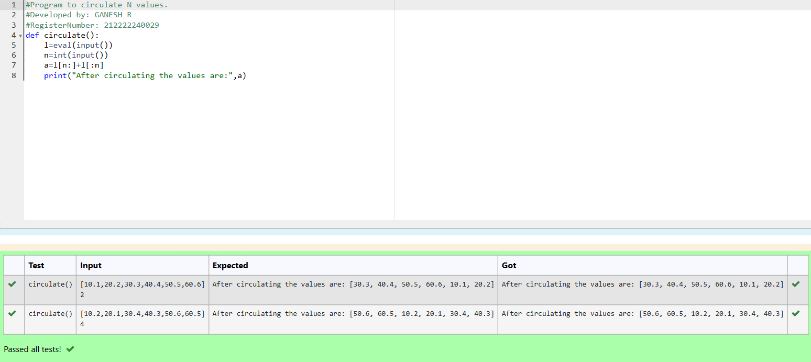

# Circulate-the-values-of-N-variables
## Aim:
To write a python program to circulate the n variables using function concept
## Equipment’s required:
PC
Anaconda - Python 3.7
## Algorithm: 
### Step 1:
 Assume the keyword to run the program
### Step 2: 
Use the circulate program
### Step 3: 
Get the value from the user for the number of rotation
### Step 4: 
Using the slicing concept rotate the list

### Step 5: 
Assign the value
### Step 6: 
print the final value
```
## Program:
#Program to circulate N values.
#Developed by: GANESH R
#RegisterNumber: 212222240029
def circulate():
    l=eval(input())
    n=int(input())
    a=l[n:]+l[:n]
    print("After circulating the values are:",a)
```
## Output:



## Result:
Thus,the experiment was executed successfully..
